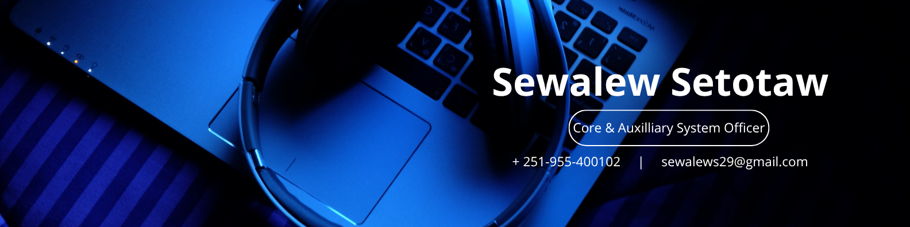

# 👋 Hi there, I'm Sewalew Setotaw!

---

## 🔍 About Me

I'm a passionate **Senior Core and Auxiliary System Officer** with experience in **Core Banking Systems (CBS)**, modern **web development**, and enterprise solutions. I specialize in:

- 🧩 **React JS**, **Tailwind CSS**, **Spring Boot**, **Oracle**, **PostgreSQL**, and **Odoo ERP**
- 🔧 Solving complex problems and automating business processes
- 🤝 Collaborating with teams to deliver innovative, scalable solutions

### 🔄 Currently:
- 🔭 Working on: Customizing the **Odoo Recuritment Module** to add advanced reporting and automation
- 🌍 Languages: **Amharic** (Native), **English** (Fluent)
- ⚡ Fun fact: Being a software developer is more than just sitting at a desk.!

📫 **Reach me anytime:** [sewalews29@gmail.com](mailto:sewalews29@gmail.com)

---

## 🛠️ My Tech Stack

### 💻 Frontend

### 🖥️ Backend / Databases

### ⚙️ Tools & ERP

---

## 💻 Featured Project

### [🎯 Quiz App](https://sewalewquizapp.netlify.app/)

A dynamic quiz application built using **React** and **Tailwind CSS**, with questions fetched in real-time from the Open Trivia DB API.

🛠️ **Tech Stack**: `React`, `Tailwind CSS`, `API Integration`

🔗 [View Live App](https://sewalewquizapp.netlify.app/)  
📁 [Repository](https://github.com/sewalewsetotaw/Sewalew_ALX_Capstone_Project)

---

## 🌐 Get in Touch

Let's connect, collaborate, or just chat tech!

- 📧 **Email**: [sewalews29@gmail.com](mailto:sewalews29@gmail.com)  
- 💼 **LinkedIn**: [linkedin.com/in/sewalew-setotaw](https://www.linkedin.com/in/sewalew-setotaw/)  
- 🐦 **Twitter**: [@SewalewSetotaw](https://twitter.com/SewalewSetotaw)

---
